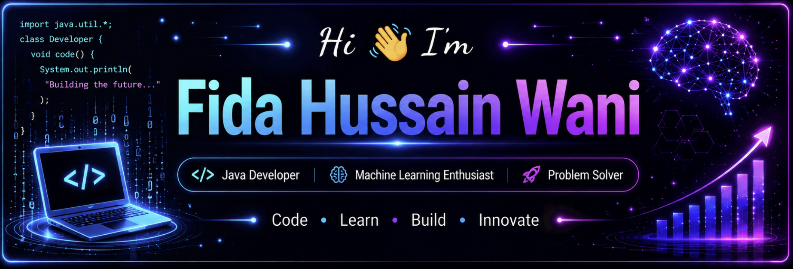

<p align="center">
  
</p>

<p align="center">
  
</p>

---

## 👨‍💻 About Me

* 🎓 B.Tech Computer Science Engineering (AI & ML) student at **Lovely Professional University**
* 💻 Passionate about **Java, Spring Boot, Machine Learning, Full-Stack Development & UI/UX**
* 🤖 Interested in building practical **AI/ML applications**
* 🌱 Currently improving my skills in **Spring Boot, REST APIs, Databases & Machine Learning**
* 🔨 I enjoy solving problems and building projects that combine software development with AI
* 📚 Constantly learning new technologies and improving my programming skills

---

## 🛠️ Tech Stack

### 👨‍💻 Languages

<p>

</p>

### 🌐 Backend & Database

<p>

</p>

### 🤖 AI / Machine Learning

<p>

</p>

**Libraries & Frameworks:**

`NumPy` • `Pandas` • `Scikit-learn` • `PyTorch` • `OpenCV` • `Streamlit`

### 🔧 Tools

<p>

</p>

---

## 🚀 Featured Projects

### 🤖 AI Surveillance & Suspicious Activity Detection

An AI-powered CCTV surveillance system designed to classify suspicious activities and generate a timeline of detected events.

**Tech:** Python • PyTorch • OpenCV • ResNet18 • Random Forest • Scikit-learn • Streamlit

**Key Features:**

* 🎥 CCTV/video analysis
* 🧠 AI-based activity classification
* 🚨 Suspicious activity detection
* 📊 Timeline generation
* 📄 Downloadable reports
* 🌐 Streamlit web interface

---

### 📚 Library Management System

A desktop-based library management application developed using Java Swing.

**Tech:** Java • Java Swing • Trie • BST • HashMap

**Features:**

* 📖 Book management
* 🔐 User authentication
* 🔍 Fast book searching
* 📥 Issue and return operations
* 💾 Data persistence

---

### 📝 PrepMate – Notes Management Platform

A full-stack notes management platform designed to help students organize and manage their study materials.

**Tech:** Java • Spring Boot • REST API • MySQL • AI/LLM Integration

---

### 🌾 Crop Recommendation System

A machine-learning-based application that recommends suitable crops based on agricultural and environmental parameters.

**Tech:** Python • Machine Learning • Scikit-learn • Flask

---

## 📊 GitHub Stats

<p align="center">
  
  
</p>

---

## 🔥 GitHub Streak

<p align="center">
  
</p>

---

## 🏆 GitHub Trophies

<p align="center">
  
</p>

---

## 📈 Contribution Graph

<p align="center">
  
</p>

---

## 📜 Certifications & Training

### ☕ Industry-Oriented Program – Core Java, Java Full Stack Development & Cloud Deployment

**CipherSchools, India**  
📅 **Jan 2026 – May 2026**

Successfully completed an industry-oriented training program covering:

- ☕ Core Java
- 🌐 Java Full Stack Development
- 🔗 Backend Development
- 🗄️ Database & SQL
- ☁️ Cloud Deployment
- 🚀 Application Development

**Certificate ID:** `CS2026-17356`

---

### 💻 Fundamentals of Data Structures

**Summer Training — June 2025 to July 2025**

Covered:

- Arrays
- Linked Lists
- Stacks & Queues
- Trees & Graphs
- Searching & Sorting Algorithms
- Java & Java Swing

---

### 🔵 Mastering in C: Basic to Beyond

**25-Hour Live C Programming Course**

Covered fundamental and advanced concepts of C programming, problem solving, and programming fundamentals.

---

## 🎯 Current Goals

```text
☑ Learn Java & Spring Boot
☑ Build REST APIs
☑ Work with MySQL
☑ Improve Data Structures & Algorithms
☑ Build AI/ML Projects
☐ Contribute to Open Source
☐ Build Production-Level Applications
☐ Get Industry Internship / Placement
```

---

## 📫 Connect With Me

<p align="center">

<a href="https://www.linkedin.com/in/fida-wani/">

</a>

<a href="mailto:fidawani20022@gmail.com">

</a>

</p>

---

<p align="center">

### 💡 "Code. Learn. Build. Repeat."

⭐ **Thanks for visiting my profile!**

</p>

